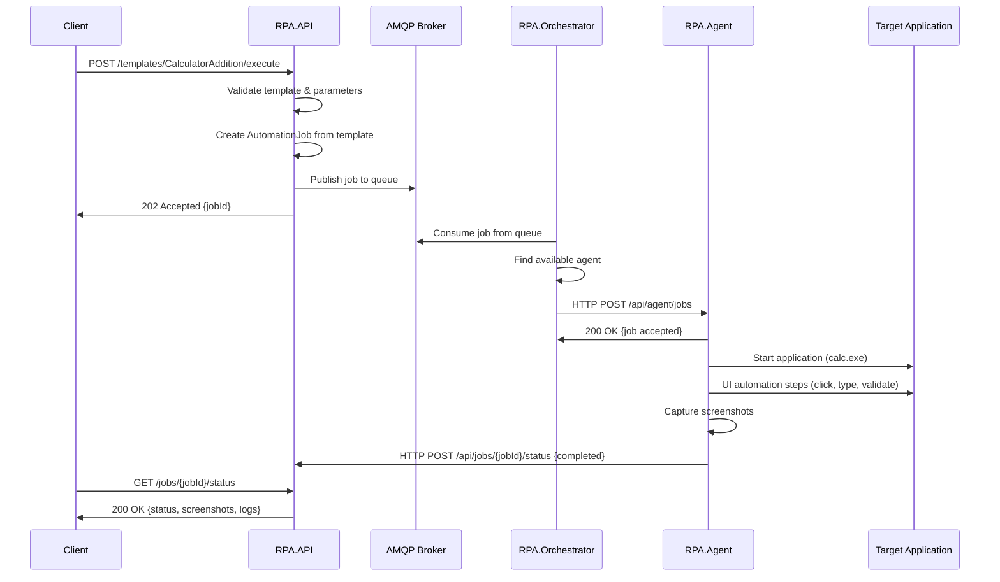

# Strategic RPA System - Technical Architecture Documentation

## Table of Contents
1. [System Overview](#system-overview)
2. [Architecture Components](#architecture-components)
3. [Data Flow & Communication](#data-flow--communication)
4. [Template-Based Automation](#template-based-automation)
5. [Session Management](#session-management)
6. [Agent Orchestration](#agent-orchestration)
7. [API Reference](#api-reference)
8. [Deployment Architecture](#deployment-architecture)
9. [Security Model](#security-model)
10. [Performance & Scalability](#performance--scalability)
11. [Error Handling & Monitoring](#error-handling--monitoring)

## System Overview

Strategic RPA is a distributed Robotic Process Automation platform built on .NET 8 with ASP.NET Core, designed for enterprise-scale automation of Windows desktop applications. The system employs a template-based approach where predefined automation workflows are executed by a pool of isolated agents running in dedicated Windows RDP sessions.

### Core Design Principles

- **Template-Based Automation**: Predefined workflows instead of client-defined automation steps
- **Session Isolation**: Each agent runs in an isolated Windows user session
- **Horizontal Scalability**: Dynamic agent pool management with automatic scaling
- **Fault Tolerance**: Comprehensive error handling and automatic recovery mechanisms
- **Security-First**: Multi-layered security with session isolation and access controls

### Technology Stack

```
Frontend Layer:    REST API (ASP.NET Core 8.0)
Message Layer:     AMQP Message Broker (RabbitMQ/Azure Service Bus)
Orchestration:     Background Services + Web API hybrid
Automation:        FlaUI (Windows UI Automation Framework)
Platform:          Windows Server 2019/2022, .NET 8.0
Database:          In-Memory (extensible to SQL Server/PostgreSQL)
Monitoring:        Built-in metrics + extensible to Application Insights
```

## Architecture Components

### 1. RPA.API (Client Interface Layer)

**Purpose**: Primary entry point for clients to execute automation templates

**Technology**: ASP.NET Core Web API (.NET 8.0)

**Key Responsibilities**:
- Template management and validation
- Client request authentication and authorization
- Job creation from templates with parameter substitution
- AMQP message publishing to orchestrator
- Real-time job status reporting

**Core Services**:

```csharp
// Template management with predefined workflows
public class AutomationTemplateService : IAutomationTemplateService
{
    // Manages predefined automation templates
    private readonly Dictionary<string, AutomationTemplate> _templates;
    
    // Creates executable jobs from templates + parameters
    public async Task<AutomationJob> CreateJobFromTemplateAsync(
        string templateId, 
        Dictionary<string, object>? parameters = null)
}

// AMQP message distribution
public class MessageQueueService : IMessageQueueService
{
    // Publishes jobs to orchestrator via message broker
    public async Task PublishJobAsync(AutomationJob job)
    
    // Receives job status updates from orchestrator
    public async Task<JobStatus> GetJobStatusAsync(Guid jobId)
}
```

**Template Structure Example**:
```csharp
new AutomationTemplate
{
    Id = "CalculatorAddition",
    Name = "Calculator Addition",
    ApplicationPath = "calc.exe",
    Parameters = new List<TemplateParameter>
    {
        new() { Name = "num1", Type = "number", Required = true },
        new() { Name = "num2", Type = "number", Required = true }
    },
    StepTemplate = new List<AutomationStepTemplate>
    {
        new() { Order = 1, Type = StepType.Click, Target = "Button[@Name='{num1}']" },
        new() { Order = 2, Type = StepType.Click, Target = "Button[@Name='+']" },
        new() { Order = 3, Type = StepType.Click, Target = "Button[@Name='{num2}']" },
        new() { Order = 4, Type = StepType.Click, Target = "Button[@Name='=']" },
        new() { Order = 5, Type = StepType.Validate, Target = "Text[@Name='Display']" }
    }
}
```

### 2. RPA.Orchestrator (Control & Management Layer)

**Purpose**: Central orchestration hub managing agent pools, job distribution, and session lifecycle

**Technology**: ASP.NET Core Web API + Background Worker hybrid (.NET 8.0-windows)

**Key Responsibilities**:
- AMQP message consumption and job queue management
- Agent pool management and health monitoring
- Windows session creation and lifecycle management
- Job-to-agent assignment with load balancing
- Real-time metrics collection and reporting

**Core Services**:

```csharp
// Central agent pool management
public class AgentManager : IAgentManager
{
    private static readonly Dictionary<Guid, Agent> _agents = new();
    
    // Dynamic agent registration with capability matching
    public async Task<Agent> RegisterAgentAsync(
        string name, 
        string windowsUser, 
        AgentCapabilities? capabilities = null)
    
    // Intelligent job assignment based on availability and capabilities
    public async Task<Agent?> AssignJobToAgentAsync(AutomationJob job)
    {
        var availableAgents = await GetAvailableAgentsAsync();
        return availableAgents
            .Where(a => CanHandleJob(a, job))
            .OrderByDescending(a => a.Metrics.SuccessRate)
            .ThenBy(a => a.JobsExecuted)
            .FirstOrDefault();
    }
}

// Windows session isolation management
public class SessionManager : ISessionManager
{
    // Creates isolated Windows user sessions
    public async Task<RdpSession> CreateSessionAsync(string windowsUser)
    {
        // 1. Create/verify Windows user exists
        await EnsureUserExistsAsync(windowsUser);
        
        // 2. Create isolated Windows session
        var sessionId = await CreateWindowsSessionAsync(windowsUser);
        
        // 3. Start Agent application in session
        await StartAgentInSessionAsync(sessionId, session.Port, windowsUser);
        
        return session;
    }
}

// HTTP communication with agents
public class AgentCommunicationService : IAgentCommunicationService
{
    // Direct HTTP job delivery to agent endpoints
    public async Task<bool> SendJobToAgentAsync(Agent agent, AutomationJob job)
    {
        var agentEndpoint = $"{agent.EndpointUrl}/jobs";
        var response = await _httpClient.PostAsync(agentEndpoint, content);
        return response.IsSuccessStatusCode;
    }
}
```

### 3. RPA.Agent (Execution Layer)

**Purpose**: UI automation execution engine running in isolated Windows sessions

**Technology**: ASP.NET Core Web API + Background Worker (.NET 8.0-windows)

**Key Responsibilities**:
- FlaUI-based Windows UI automation execution
- Job execution with step-by-step processing
- Screenshot capture and execution logging
- Health monitoring and status reporting
- Graceful shutdown and resource cleanup

**Core Services**:

```csharp
// Windows UI automation engine
public class AutomationService : IAutomationService
{
    private readonly UIA3Automation _automation;
    
    // Main job execution pipeline
    public async Task<ExecutionResult> ExecuteJobAsync(AutomationJob job)
    {
        Application? application = null;
        
        // 1. Start target application
        if (!string.IsNullOrEmpty(job.ApplicationPath))
            application = await StartApplicationAsync(job.ApplicationPath);
        
        // 2. Execute automation steps sequentially
        foreach (var step in job.Steps)
        {
            var stepResult = await ExecuteStepAsync(step, application);
            if (!stepResult.Success && !step.IsOptional)
                throw new InvalidOperationException($"Step '{step.Name}' failed");
        }
        
        return result;
    }
    
    // Individual step execution with FlaUI
    public async Task<ExecutionResult> ExecuteStepAsync(
        AutomationStep step, 
        Application? application = null)
    {
        switch (step.Type)
        {
            case StepType.Click:
                return await ClickElementAsync(step, application);
            case StepType.Type:
                return await TypeTextAsync(step, application);
            case StepType.Validate:
                return await ValidateElementAsync(step, application);
            // ... other step types
        }
    }
}

// HTTP API for receiving jobs from orchestrator
[ApiController]
[Route("api/agent")]
public class AgentController : ControllerBase
{
    // Receives jobs from orchestrator
    [HttpPost("jobs")]
    public async Task<IActionResult> ReceiveJob([FromBody] AutomationJob job)
    {
        // Execute job asynchronously
        _ = Task.Run(async () =>
        {
            var result = await _jobExecutor.ExecuteJobAsync(job);
            await _apiReportingService.ReportJobStatusAsync(
                job.Id, 
                result.Success ? JobStatus.Success : JobStatus.Failed, 
                result.Message);
        });
        
        return Ok(new { Message = "Job accepted", JobId = job.Id });
    }
}
```

## Data Flow & Communication

### Complete Request Flow



### Message Flow Details

#### 1. Client Request Processing
```csharp
// API receives template execution request
[HttpPost("templates/{templateId}/execute")]
public async Task<IActionResult> ExecuteTemplate(
    string templateId,
    [FromBody] Dictionary<string, object> parameters)
{
    // 1. Retrieve template definition
    var template = await _templateService.GetTemplateAsync(templateId);
    
    // 2. Create job with parameter substitution
    var job = await _templateService.CreateJobFromTemplateAsync(templateId, parameters);
    
    // 3. Publish to message queue
    await _messageQueueService.PublishJobAsync(job);
    
    return Accepted(new { JobId = job.Id });
}
```

#### 2. AMQP Message Structure
```json
{
  "messageId": "uuid",
  "timestamp": "2024-11-19T10:30:00Z",
  "messageType": "AutomationJobRequest",
  "payload": {
    "id": "job-uuid",
    "templateId": "CalculatorAddition",
    "name": "Calculator Addition Job",
    "applicationPath": "calc.exe",
    "parameters": {
      "num1": 5,
      "num2": 3
    },
    "steps": [
      {
        "order": 1,
        "type": "Click",
        "target": "Button[@Name='5']",
        "description": "Click number 5"
      }
    ],
    "priority": "Normal",
    "timeoutMinutes": 10
  }
}
```

#### 3. Orchestrator Job Processing
```csharp
// Background service consuming AMQP messages
[HttpPost("jobs/process")]
public async Task<IActionResult> ProcessJob([FromBody] AutomationJob job)
{
    // 1. Find suitable agent
    var agent = await _agentManager.AssignJobToAgentAsync(job);
    if (agent == null)
    {
        await _messageQueueService.RequeueJobAsync(job, TimeSpan.FromMinutes(5));
        return Accepted("No available agents - job requeued");
    }
    
    // 2. Send job to agent
    var success = await _agentCommunication.SendJobToAgentAsync(agent, job);
    if (!success)
    {
        await _agentManager.ReleaseAgentAsync(agent.Id);
        return BadRequest("Failed to send job to agent");
    }
    
    return Ok("Job assigned successfully");
}
```

## Template-Based Automation

### Template Definition Structure

Templates define reusable automation workflows with parameterization support:

```csharp
public class AutomationTemplate
{
    public required string Id { get; set; }                    // Unique identifier
    public required string Name { get; set; }                  // Human-readable name
    public required string Description { get; set; }           // Template description
    public required string ApplicationPath { get; set; }       // Target application
    public string? Arguments { get; set; }                     // Application launch args
    public List<TemplateParameter> Parameters { get; set; }    // Input parameters
    public List<AutomationStepTemplate> StepTemplate { get; set; } // Automation steps
    public TimeSpan DefaultTimeout { get; set; } = TimeSpan.FromMinutes(10);
    public TemplateMetadata Metadata { get; set; } = new();
}

public class TemplateParameter
{
    public required string Name { get; set; }          // Parameter name
    public required string Type { get; set; }          // Data type (string, number, boolean)
    public required bool Required { get; set; }        // Validation requirement
    public string? Description { get; set; }           // Parameter description
    public object? DefaultValue { get; set; }          // Default value if not provided
    public string? ValidationRegex { get; set; }       // Input validation pattern
}

public class AutomationStepTemplate
{
    public int Order { get; set; }                     // Execution sequence
    public StepType Type { get; set; }                 // Step type (Click, Type, Validate, etc.)
    public required string Target { get; set; }        // UI element selector
    public string? Value { get; set; }                 // Input value or expected value
    public string? Description { get; set; }           // Step description
    public bool IsOptional { get; set; }               // Continue on failure
    public TimeSpan Timeout { get; set; } = TimeSpan.FromSeconds(30);
    public Dictionary<string, object> Properties { get; set; } = new();
}
```

### Parameter Substitution Engine

The template engine supports dynamic parameter substitution using token replacement:

```csharp
public class TemplateParameterEngine
{
    public AutomationJob ProcessTemplate(
        AutomationTemplate template, 
        Dictionary<string, object> parameters)
    {
        // 1. Validate required parameters
        ValidateParameters(template.Parameters, parameters);
        
        // 2. Create job from template
        var job = new AutomationJob
        {
            Id = Guid.NewGuid(),
            Name = template.Name,
            ApplicationPath = template.ApplicationPath,
            Steps = new List<AutomationStep>()
        };
        
        // 3. Process each step template with parameter substitution
        foreach (var stepTemplate in template.StepTemplate.OrderBy(s => s.Order))
        {
            var step = new AutomationStep
            {
                Name = stepTemplate.Description ?? $"Step {stepTemplate.Order}",
                Type = stepTemplate.Type,
                Target = SubstituteParameters(stepTemplate.Target, parameters),
                Value = SubstituteParameters(stepTemplate.Value, parameters),
                IsOptional = stepTemplate.IsOptional,
                Timeout = stepTemplate.Timeout
            };
            
            job.Steps.Add(step);
        }
        
        return job;
    }
    
    private string SubstituteParameters(string? template, Dictionary<string, object> parameters)
    {
        if (string.IsNullOrEmpty(template)) return string.Empty;
        
        // Replace {parameterName} tokens with actual values
        var result = template;
        foreach (var param in parameters)
        {
            result = result.Replace($"{{{param.Key}}}", param.Value.ToString());
        }
        
        return result;
    }
}
```

### Predefined Templates

#### Calculator Addition Template
```csharp
"CalculatorAddition" => new AutomationTemplate
{
    Id = "CalculatorAddition",
    Name = "Calculator Addition",
    Description = "Performs addition operation using Windows Calculator",
    ApplicationPath = "calc.exe",
    Parameters = new List<TemplateParameter>
    {
        new() { Name = "num1", Type = "number", Required = true, Description = "First number" },
        new() { Name = "num2", Type = "number", Required = true, Description = "Second number" }
    },
    StepTemplate = new List<AutomationStepTemplate>
    {
        new() { Order = 1, Type = StepType.Click, Target = "Button[@Name='{num1}']", Description = "Click first number" },
        new() { Order = 2, Type = StepType.Click, Target = "Button[@Name='+']", Description = "Click plus operator" },
        new() { Order = 3, Type = StepType.Click, Target = "Button[@Name='{num2}']", Description = "Click second number" },
        new() { Order = 4, Type = StepType.Click, Target = "Button[@Name='=']", Description = "Click equals" },
        new() { Order = 5, Type = StepType.Validate, Target = "Text[@Name='Display']", Value = "{result}", Description = "Validate result" }
    }
}
```

#### Notepad Text Writing Template
```csharp
"NotepadWriting" => new AutomationTemplate
{
    Id = "NotepadWriting",
    Name = "Notepad Text Writing",
    Description = "Opens Notepad and writes specified text content",
    ApplicationPath = "notepad.exe",
    Parameters = new List<TemplateParameter>
    {
        new() { Name = "content", Type = "string", Required = true, Description = "Text content to write" },
        new() { Name = "saveAs", Type = "string", Required = false, Description = "File path to save (optional)" }
    },
    StepTemplate = new List<AutomationStepTemplate>
    {
        new() { Order = 1, Type = StepType.Wait, Value = "2000", Description = "Wait for Notepad to load" },
        new() { Order = 2, Type = StepType.Type, Target = "Edit[@Name='Text Editor']", Value = "{content}", Description = "Type text content" },
        new() { Order = 3, Type = StepType.KeyPress, Value = "Ctrl+S", Description = "Save document", IsOptional = true },
        new() { Order = 4, Type = StepType.Type, Target = "Edit[@Name='File name:']", Value = "{saveAs}", Description = "Enter filename", IsOptional = true }
    }
}
```

## Session Management

### Windows Session Architecture

The Strategic RPA system uses Windows user sessions to provide complete isolation between concurrent automation executions:

```
Windows Server 2022
├── Session 0 (System Services)
├── Session 1 (Console - Orchestrator)
├── Session 1001 (RDP - Agent User 1) → Agent Port 8080
├── Session 1002 (RDP - Agent User 2) → Agent Port 8081
├── Session 1003 (RDP - Agent User 3) → Agent Port 8082
└── ...
```

### Session Creation Process

```csharp
public class SessionManager : ISessionManager
{
    public async Task<RdpSession> CreateSessionAsync(string windowsUser)
    {
        // 1. Ensure Windows user exists with proper permissions
        await EnsureUserExistsAsync(windowsUser);
        
        // 2. Create isolated Windows session
        var sessionId = await CreateWindowsSessionAsync(windowsUser);
        
        // 3. Start Agent application in the session
        await StartAgentInSessionAsync(sessionId, session.Port, windowsUser);
        
        // 4. Configure session monitoring
        await ConfigureSessionMonitoringAsync(sessionId, session.SessionId);
        
        return session;
    }
    
    private async Task EnsureUserExistsAsync(string username)
    {
        using var context = new PrincipalContext(ContextType.Machine);
        var user = UserPrincipal.FindByIdentity(context, username);
        
        if (user == null)
        {
            // Create new Windows user
            var newUser = new UserPrincipal(context)
            {
                Name = username,
                DisplayName = $"RPA Agent User - {username}",
                Description = "Automated user for RPA Agent execution",
                PasswordNeverExpires = true,
                UserCannotChangePassword = true
            };
            
            var password = GenerateSecurePassword();
            newUser.SetPassword(password);
            newUser.Save();
            
            // Add to Remote Desktop Users group
            using var group = GroupPrincipal.FindByIdentity(context, "Remote Desktop Users");
            group?.Members.Add(newUser);
            group?.Save();
        }
    }
}
```

### Session Lifecycle Management

#### Session States
```csharp
public enum SessionStatus
{
    Creating,     // Session creation in progress
    Starting,     // Agent startup in progress
    Active,       // Ready for job execution
    Idle,         // No active jobs
    Busy,         // Executing automation
    Recycling,    // Cleanup and restart process
    Terminating,  // Shutdown in progress
    Terminated,   // Session ended
    Unhealthy,    // Health check failures
    Error         // Unrecoverable error state
}
```

#### Session Metrics Collection
```csharp
public class SessionMetrics
{
    public TimeSpan TotalUptime => DateTime.UtcNow - CreatedAt;
    public int TotalJobs { get; set; }
    public TimeSpan AverageJobDuration { get; set; }
    public long MemoryUsageMB { get; set; }
    public double CpuUsagePercent { get; set; }
    public int SuccessfulJobs { get; set; }
    public int FailedJobs { get; set; }
    public DateTime? LastJobCompletedAt { get; set; }
}
```

### Agent Registration and Discovery

When a Windows session starts, the Agent automatically registers itself with the Orchestrator:

```csharp
// Agent startup process
protected override async Task ExecuteAsync(CancellationToken stoppingToken)
{
    // 1. Start Web API server on assigned port
    await StartWebApiAsync();
    
    // 2. Register with orchestrator
    await RegisterWithOrchestratorAsync();
    
    // 3. Start background services
    var tasks = new[]
    {
        SendHeartbeatAsync(stoppingToken),      // Health monitoring
        MonitorResourceUsageAsync(stoppingToken) // Performance tracking
    };
    
    await Task.WhenAny(tasks);
}

private async Task RegisterWithOrchestratorAsync()
{
    var registration = new AgentRegistration
    {
        Name = Environment.MachineName,
        WindowsUser = Environment.UserName,
        EndpointUrl = $"http://localhost:{_port}/api/agent",
        Capabilities = GetAgentCapabilities(),
        Version = Assembly.GetExecutingAssembly().GetName().Version?.ToString()
    };
    
    var response = await _httpClient.PostAsJsonAsync(
        "http://localhost:5001/api/orchestrator/agents/register", 
        registration);
        
    if (response.IsSuccessStatusCode)
    {
        _logger.LogInformation("Agent registered successfully");
    }
}
```

## Agent Orchestration

### Agent Pool Management

The Orchestrator maintains a dynamic pool of agents with intelligent assignment algorithms:

```csharp
public class AgentManager : IAgentManager
{
    private static readonly Dictionary<Guid, Agent> _agents = new();
    
    public async Task<Agent?> AssignJobToAgentAsync(AutomationJob job)
    {
        var availableAgents = await GetAvailableAgentsAsync();
        
        // Multi-criteria agent selection
        var suitableAgent = availableAgents
            .Where(a => CanHandleJob(a, job))                    // Capability matching
            .Where(a => a.Status == AgentStatus.Idle)            // Availability check
            .OrderByDescending(a => a.Metrics.SuccessRate)       // Success rate priority
            .ThenBy(a => a.JobsExecuted)                         // Load balancing
            .ThenBy(a => a.Metrics.AverageJobDuration)           // Performance optimization
            .FirstOrDefault();
            
        if (suitableAgent != null)
        {
            await UpdateAgentStatusAsync(suitableAgent.Id, AgentStatus.Busy);
            suitableAgent.CurrentJobId = job.Id.ToString();
            
            _logger.LogInformation("Assigned job {JobId} to agent {AgentId}", 
                job.Id, suitableAgent.Id);
        }
        
        return suitableAgent;
    }
    
    // Capability-based job matching
    private bool CanHandleJob(Agent agent, AutomationJob job)
    {
        // 1. Check supported applications
        if (agent.Capabilities.SupportedApplications.Count > 0)
        {
            var supportedApp = agent.Capabilities.SupportedApplications
                .Any(app => job.ApplicationPath.Contains(app, StringComparison.OrdinalIgnoreCase));
            if (!supportedApp) return false;
        }
        
        // 2. Check resource requirements
        if (job.RequiredMemoryMB > agent.Capabilities.AvailableMemoryMB)
            return false;
            
        // 3. Check concurrent job limits
        if (agent.Capabilities.MaxConcurrentJobs <= agent.ActiveJobCount)
            return false;
            
        return true;
    }
}
```

### Agent Health Monitoring

```csharp
public class HealthMonitor : BackgroundService
{
    protected override async Task ExecuteAsync(CancellationToken stoppingToken)
    {
        while (!stoppingToken.IsCancellationRequested)
        {
            var agents = await _agentManager.GetAllAgentsAsync();
            
            foreach (var agent in agents)
            {
                try
                {
                    // 1. HTTP health check
                    var healthStatus = await CheckAgentHealthAsync(agent);
                    
                    // 2. Performance metrics collection
                    var metrics = await CollectAgentMetricsAsync(agent);
                    
                    // 3. Update agent status
                    await UpdateAgentHealthAsync(agent, healthStatus, metrics);
                    
                    // 4. Trigger recycling if needed
                    if (ShouldRecycleAgent(agent))
                    {
                        await _agentManager.RecycleAgentAsync(agent.Id);
                    }
                }
                catch (Exception ex)
                {
                    _logger.LogError(ex, "Health check failed for agent {AgentId}", agent.Id);
                    await _agentManager.UpdateAgentStatusAsync(agent.Id, AgentStatus.Unhealthy);
                }
            }
            
            await Task.Delay(TimeSpan.FromSeconds(30), stoppingToken);
        }
    }
    
    private bool ShouldRecycleAgent(Agent agent)
    {
        // Recycle criteria
        return agent.JobsExecuted >= 50 ||                                    // Job count limit
               agent.Metrics.TotalUptime > TimeSpan.FromHours(8) ||           // Uptime limit
               agent.Metrics.MemoryUsageMB > agent.Capabilities.MaxMemoryMB ||// Memory threshold
               agent.LastHeartbeat < DateTime.UtcNow.AddMinutes(-5);          // Heartbeat timeout
    }
}
```

### Load Balancing Strategies

#### Round Robin with Capability Matching
```csharp
public class RoundRobinLoadBalancer : ILoadBalancer
{
    private int _lastAssignedIndex = 0;
    
    public Agent? SelectAgent(List<Agent> availableAgents, AutomationJob job)
    {
        var suitableAgents = availableAgents.Where(a => CanHandleJob(a, job)).ToList();
        
        if (!suitableAgents.Any()) return null;
        
        var selectedAgent = suitableAgents[_lastAssignedIndex % suitableAgents.Count];
        _lastAssignedIndex++;
        
        return selectedAgent;
    }
}
```

#### Performance-Based Selection
```csharp
public class PerformanceLoadBalancer : ILoadBalancer
{
    public Agent? SelectAgent(List<Agent> availableAgents, AutomationJob job)
    {
        return availableAgents
            .Where(a => CanHandleJob(a, job))
            .OrderByDescending(a => CalculatePerformanceScore(a))
            .FirstOrDefault();
    }
    
    private double CalculatePerformanceScore(Agent agent)
    {
        var successRate = agent.Metrics.SuccessfulJobs / (double)Math.Max(agent.Metrics.TotalJobs, 1);
        var avgDuration = agent.Metrics.AverageJobDuration.TotalSeconds;
        var utilizationRate = 1.0 - (agent.JobsExecuted / 50.0); // Prefer less utilized agents
        
        // Weighted scoring algorithm
        return (successRate * 0.4) + 
               (Math.Max(0, 300 - avgDuration) / 300.0 * 0.3) + 
               (utilizationRate * 0.3);
    }
}
```

## API Reference

### RPA.API Endpoints

#### Template Management
```http
GET /api/templates
Content-Type: application/json

Response:
[
  {
    "id": "CalculatorAddition",
    "name": "Calculator Addition",
    "description": "Performs addition operation using Windows Calculator",
    "parameters": [
      {
        "name": "num1",
        "type": "number",
        "required": true,
        "description": "First number"
      }
    ]
  }
]
```

#### Template Execution
```http
POST /api/templates/{templateId}/execute
Content-Type: application/json

Request Body:
{
  "num1": 5,
  "num2": 3
}

Response:
{
  "jobId": "550e8400-e29b-41d4-a716-446655440000",
  "status": "Accepted",
  "message": "Job queued for execution"
}
```

#### Job Status Monitoring
```http
GET /api/jobs/{jobId}/status
Content-Type: application/json

Response:
{
  "jobId": "550e8400-e29b-41d4-a716-446655440000",
  "status": "Success",
  "startedAt": "2024-11-19T10:30:00Z",
  "completedAt": "2024-11-19T10:30:45Z",
  "duration": "00:00:45",
  "result": {
    "success": true,
    "message": "Addition completed successfully",
    "screenshots": [
      "/screenshots/job-uuid_start.png",
      "/screenshots/job-uuid_step1.png"
    ],
    "logs": [
      {
        "timestamp": "2024-11-19T10:30:05Z",
        "level": "Info",
        "message": "Started Calculator application"
      }
    ]
  }
}
```

### RPA.Orchestrator Endpoints

#### Agent Management
```http
POST /api/orchestrator/agents/register
Content-Type: application/json

Request Body:
{
  "name": "Agent-01",
  "windowsUser": "rpa-agent-01",
  "endpointUrl": "http://localhost:8080/api/agent",
  "capabilities": {
    "supportedApplications": ["calc.exe", "notepad.exe"],
    "maxConcurrentJobs": 1,
    "availableMemoryMB": 2048
  }
}

Response:
{
  "agentId": "agent-uuid",
  "status": "Registered",
  "sessionId": "session-uuid"
}
```

#### System Metrics
```http
GET /api/orchestrator/metrics
Content-Type: application/json

Response:
{
  "totalAgents": 5,
  "availableAgents": 3,
  "busyAgents": 2,
  "totalJobs": 1250,
  "successfulJobs": 1200,
  "failedJobs": 50,
  "averageJobDuration": "00:02:30",
  "systemUptime": "15.08:30:00"
}
```

### RPA.Agent Endpoints

#### Job Execution
```http
POST /api/agent/jobs
Content-Type: application/json

Request Body:
{
  "id": "job-uuid",
  "name": "Calculator Addition Job",
  "applicationPath": "calc.exe",
  "steps": [
    {
      "name": "Click number 5",
      "type": "Click",
      "target": "Button[@Name='5']",
      "timeout": "00:00:30"
    }
  ]
}

Response:
{
  "message": "Job accepted",
  "jobId": "job-uuid"
}
```

#### Health Check
```http
GET /api/agent/health
Content-Type: application/json

Response:
{
  "status": "Healthy",
  "timestamp": "2024-11-19T10:30:00Z",
  "version": "1.0.0",
  "memoryUsageMB": 150,
  "cpuUsagePercent": 15.5
}
```

## Deployment Architecture

### Single Server Deployment

For development and small-scale deployments, all components can run on a single Windows Server:

```
Windows Server 2022 (16GB RAM, 8 cores)
├── C:\RPA\
│   ├── API\
│   │   ├── RPA.API.exe (Port 5000)
│   │   ├── appsettings.json
│   │   └── logs\
│   ├── Orchestrator\
│   │   ├── RPA.Orchestrator.exe (Port 5001)
│   │   ├── appsettings.json
│   │   └── logs\
│   ├── Agents\
│   │   ├── Agent-Template\
│   │   │   ├── RPA.Agent.exe
│   │   │   └── appsettings.json
│   │   └── Screenshots\
│   └── Shared\
│       ├── Templates\
│       └── Logs\
├── C:\Users\
│   ├── rpa-agent-01\ (Session 1001)
│   ├── rpa-agent-02\ (Session 1002)
│   └── rpa-agent-03\ (Session 1003)
└── Services\
    ├── RabbitMQ (Port 5672)
    ├── Redis Cache (Port 6379)
    └── Application Insights Agent
```

### Multi-Server Deployment

For production environments with high availability and scalability:

```
Load Balancer (nginx/IIS ARR)
├── API Server 1 (RPA.API instances)
├── API Server 2 (RPA.API instances)
└── API Server N

Orchestrator Cluster
├── Orchestrator Primary (Leader)
├── Orchestrator Secondary (Follower)
└── Orchestrator Tertiary (Follower)

Agent Farm
├── Agent Server 1 (10 agent sessions)
├── Agent Server 2 (10 agent sessions)
└── Agent Server N (10 agent sessions)

Infrastructure Services
├── RabbitMQ Cluster (3 nodes)
├── Redis Cluster (3 nodes)
├── SQL Server (Primary/Secondary)
└── Application Insights
```

### Configuration Management

#### API Configuration (appsettings.json)
```json
{
  "ConnectionStrings": {
    "MessageQueue": "amqp://localhost:5672",
    "Redis": "localhost:6379",
    "Database": "Server=localhost;Database=StrategicRPA;Trusted_Connection=true;"
  },
  "RPA": {
    "OrchestratorUrl": "http://localhost:5001",
    "DefaultJobTimeout": "00:10:00",
    "MaxConcurrentJobs": 100,
    "EnableDetailedLogging": true
  },
  "Authentication": {
    "JwtSecret": "your-secret-key",
    "TokenExpirationMinutes": 60
  },
  "Logging": {
    "LogLevel": {
      "Default": "Information",
      "Microsoft.AspNetCore": "Warning"
    }
  }
}
```

#### Orchestrator Configuration
```json
{
  "ConnectionStrings": {
    "MessageQueue": "amqp://localhost:5672",
    "Database": "Server=localhost;Database=StrategicRPA;Trusted_Connection=true;"
  },
  "Agent": {
    "ExecutablePath": "C:\\RPA\\Agents\\Agent-Template\\RPA.Agent.exe",
    "DefaultHeartbeatInterval": "00:00:30",
    "MaxJobExecutionTime": "00:10:00",
    "RecycleAfterJobs": 50
  },
  "RDP": {
    "BasePort": 3390,
    "MaxSessions": 20,
    "SessionTimeout": "08:00:00"
  },
  "LoadBalancing": {
    "Strategy": "Performance", // RoundRobin, Performance, LeastUtilized
    "HealthCheckInterval": "00:00:30"
  }
}
```

#### Agent Configuration
```json
{
  "Agent": {
    "Name": "Agent-{COMPUTERNAME}",
    "OrchestratorUrl": "http://localhost:5001",
    "Port": 8080,
    "HeartbeatIntervalSeconds": 30,
    "MaxConcurrentJobs": 1
  },
  "Automation": {
    "ScreenshotDirectory": "C:\\RPA\\Screenshots",
    "EnableScreenshots": true,
    "ElementTimeout": "00:00:30",
    "ApplicationTimeout": "00:02:00"
  },
  "FlaUI": {
    "AutomationType": "UIA3",
    "RetryAttempts": 3,
    "RetryInterval": "00:00:01"
  }
}
```

## Security Model

### Authentication & Authorization

#### API Security
```csharp
// JWT-based authentication
[Authorize]
[ApiController]
public class TemplatesController : ControllerBase
{
    [HttpPost("{templateId}/execute")]
    [RequirePermission("automation.execute")]
    public async Task<IActionResult> ExecuteTemplate(string templateId)
    {
        var userId = User.FindFirst(ClaimTypes.NameIdentifier)?.Value;
        var userRoles = User.FindAll(ClaimTypes.Role).Select(c => c.Value);
        
        // Template-based authorization
        if (!await _authService.CanExecuteTemplateAsync(userId, templateId))
        {
            return Forbid("Insufficient permissions for template execution");
        }
        
        // Rate limiting per user
        if (!await _rateLimiter.TryAcquireAsync(userId, TimeSpan.FromMinutes(1), 10))
        {
            return TooManyRequests("Rate limit exceeded");
        }
        
        return await ExecuteTemplateInternal(templateId);
    }
}
```

#### Role-Based Access Control
```csharp
public enum RpaPermission
{
    ViewTemplates,
    ExecuteTemplates,
    ManageAgents,
    ViewMetrics,
    SystemAdministration
}

public class RpaRole
{
    public const string Operator = "RPA.Operator";           // Execute templates only
    public const string Administrator = "RPA.Administrator"; // Full system access
    public const string Viewer = "RPA.Viewer";              // Read-only access
}
```

### Session Security

#### Windows User Isolation
```csharp
private async Task EnsureUserExistsAsync(string username)
{
    using var context = new PrincipalContext(ContextType.Machine);
    var user = UserPrincipal.FindByIdentity(context, username);
    
    if (user == null)
    {
        var newUser = new UserPrincipal(context)
        {
            // Security hardening
            Name = username,
            PasswordNeverExpires = true,
            UserCannotChangePassword = true,
            AccountExpirationDate = null,  // Never expire
            SmartcardLogonRequired = false,
            DelegationPermitted = false    // Prevent delegation attacks
        };
        
        // Generate cryptographically secure password
        var password = GenerateSecurePassword(16);
        newUser.SetPassword(password);
        
        // Minimal group membership
        using var rdpGroup = GroupPrincipal.FindByIdentity(context, "Remote Desktop Users");
        rdpGroup?.Members.Add(newUser);
        
        newUser.Save();
    }
}

private string GenerateSecurePassword(int length)
{
    using var rng = RandomNumberGenerator.Create();
    const string validChars = "ABCDEFGHIJKLMNOPQRSTUVWXYZabcdefghijklmnopqrstuvwxyz0123456789!@#$%^&*";
    
    var bytes = new byte[length];
    rng.GetBytes(bytes);
    
    return new string(bytes.Select(b => validChars[b % validChars.Length]).ToArray());
}
```

#### Network Security
```csharp
// Agent endpoint security
[ApiController]
[Route("api/agent")]
public class AgentController : ControllerBase
{
    [HttpPost("jobs")]
    [AllowAnonymous] // Internal communication - IP restriction applied
    public async Task<IActionResult> ReceiveJob([FromBody] AutomationJob job)
    {
        // IP allowlist for orchestrator communication
        var clientIp = HttpContext.Connection.RemoteIpAddress;
        if (!_ipAllowlist.Contains(clientIp))
        {
            _logger.LogWarning("Unauthorized access attempt from {IP}", clientIp);
            return Forbid("IP address not authorized");
        }
        
        // Request signature verification
        var requestSignature = Request.Headers["X-RPA-Signature"].FirstOrDefault();
        if (!VerifyRequestSignature(job, requestSignature))
        {
            return Unauthorized("Invalid request signature");
        }
        
        return await ProcessJobAsync(job);
    }
}
```

### Data Protection

#### Sensitive Data Handling
```csharp
public class SecureParameterService
{
    private readonly IDataProtectionProvider _dataProtector;
    
    public AutomationJob CreateSecureJob(AutomationTemplate template, Dictionary<string, object> parameters)
    {
        var protector = _dataProtector.CreateProtector("RPA.Parameters");
        var secureJob = new AutomationJob();
        
        // Encrypt sensitive parameter values
        foreach (var param in parameters)
        {
            if (IsSensitiveParameter(param.Key))
            {
                var encryptedValue = protector.Protect(param.Value.ToString());
                secureJob.EncryptedParameters[param.Key] = encryptedValue;
            }
            else
            {
                secureJob.Parameters[param.Key] = param.Value;
            }
        }
        
        return secureJob;
    }
    
    private bool IsSensitiveParameter(string parameterName)
    {
        var sensitivePatterns = new[] { "password", "secret", "key", "token", "credential" };
        return sensitivePatterns.Any(pattern => 
            parameterName.Contains(pattern, StringComparison.OrdinalIgnoreCase));
    }
}
```

## Performance & Scalability

### Performance Optimization

#### Connection Pooling
```csharp
public class HttpClientFactory
{
    private static readonly Dictionary<string, HttpClient> _clients = new();
    private static readonly object _lock = new object();
    
    public static HttpClient GetClient(string baseAddress)
    {
        lock (_lock)
        {
            if (!_clients.ContainsKey(baseAddress))
            {
                _clients[baseAddress] = new HttpClient(new SocketsHttpHandler
                {
                    MaxConnectionsPerServer = 20,
                    PooledConnectionLifetime = TimeSpan.FromMinutes(15),
                    PooledConnectionIdleTimeout = TimeSpan.FromMinutes(5)
                })
                {
                    BaseAddress = new Uri(baseAddress),
                    Timeout = TimeSpan.FromSeconds(30)
                };
            }
            
            return _clients[baseAddress];
        }
    }
}
```

#### Message Queue Optimization
```csharp
public class OptimizedMessageQueueService : IMessageQueueService
{
    private readonly IChannel _channel;
    private readonly TaskCompletionSource<bool> _connectionReady;
    
    public async Task PublishJobAsync(AutomationJob job)
    {
        // Ensure connection is ready
        await _connectionReady.Task;
        
        // Use message compression for large payloads
        var messageBody = job.EstimatedSize > 1024 
            ? CompressMessage(JsonSerializer.Serialize(job))
            : JsonSerializer.SerializeToUtf8Bytes(job);
            
        // Persistent messages for reliability
        var properties = new BasicProperties
        {
            Persistent = true,
            Priority = GetJobPriority(job),
            Expiration = job.Timeout.TotalMilliseconds.ToString(),
            MessageId = job.Id.ToString(),
            Timestamp = new AmqpTimestamp(DateTimeOffset.UtcNow.ToUnixTimeSeconds())
        };
        
        await _channel.BasicPublishAsync(
            exchange: "rpa.jobs",
            routingKey: GetRoutingKey(job),
            mandatory: true,
            basicProperties: properties,
            body: messageBody);
    }
}
```

### Scalability Patterns

#### Horizontal Scaling
```csharp
public class ScalingController : BackgroundService
{
    protected override async Task ExecuteAsync(CancellationToken stoppingToken)
    {
        while (!stoppingToken.IsCancellationRequested)
        {
            var metrics = await _metricsCollector.GetSystemMetricsAsync();
            
            // Auto-scaling decision logic
            if (ShouldScaleUp(metrics))
            {
                await ScaleUpAsync();
            }
            else if (ShouldScaleDown(metrics))
            {
                await ScaleDownAsync();
            }
            
            await Task.Delay(TimeSpan.FromMinutes(5), stoppingToken);
        }
    }
    
    private bool ShouldScaleUp(SystemMetrics metrics)
    {
        return metrics.QueueDepth > 10 &&                    // Queue backlog
               metrics.AvailableAgents == 0 &&               // No idle agents
               metrics.AverageJobWaitTime > TimeSpan.FromMinutes(2); // Wait time threshold
    }
    
    private async Task ScaleUpAsync()
    {
        var maxAgents = _configuration.GetValue<int>("Scaling:MaxAgents", 20);
        var currentAgents = await _agentManager.GetAgentCountAsync();
        
        if (currentAgents < maxAgents)
        {
            var newAgentUser = $"rpa-agent-{currentAgents + 1:D2}";
            await _agentManager.RegisterAgentAsync($"Agent-{currentAgents + 1}", newAgentUser);
            
            _logger.LogInformation("Scaled up: Created new agent {AgentUser}", newAgentUser);
        }
    }
}
```

#### Caching Strategy
```csharp
public class CachedTemplateService : IAutomationTemplateService
{
    private readonly IMemoryCache _cache;
    private readonly IAutomationTemplateService _innerService;
    
    public async Task<AutomationTemplate?> GetTemplateAsync(string templateId)
    {
        var cacheKey = $"template:{templateId}";
        
        if (_cache.TryGetValue(cacheKey, out AutomationTemplate cachedTemplate))
        {
            return cachedTemplate;
        }
        
        var template = await _innerService.GetTemplateAsync(templateId);
        if (template != null)
        {
            _cache.Set(cacheKey, template, TimeSpan.FromMinutes(30));
        }
        
        return template;
    }
}
```

## Error Handling & Monitoring

### Comprehensive Error Handling

#### Resilience Patterns
```csharp
public class ResilientAgentCommunicationService : IAgentCommunicationService
{
    private readonly IRetryPolicy _retryPolicy;
    private readonly ICircuitBreaker _circuitBreaker;
    
    public async Task<bool> SendJobToAgentAsync(Agent agent, AutomationJob job)
    {
        return await _retryPolicy.ExecuteAsync(async () =>
        {
            return await _circuitBreaker.ExecuteAsync(async () =>
            {
                try
                {
                    var response = await _httpClient.PostAsJsonAsync(
                        $"{agent.EndpointUrl}/jobs", 
                        job,
                        cancellationToken: new CancellationTokenSource(TimeSpan.FromSeconds(30)).Token);
                        
                    return response.IsSuccessStatusCode;
                }
                catch (HttpRequestException ex)
                {
                    _logger.LogWarning(ex, "HTTP communication failed with agent {AgentId}", agent.Id);
                    await _agentManager.UpdateAgentStatusAsync(agent.Id, AgentStatus.Unhealthy);
                    throw;
                }
                catch (TaskCanceledException ex)
                {
                    _logger.LogWarning(ex, "Timeout communicating with agent {AgentId}", agent.Id);
                    throw;
                }
            });
        });
    }
}
```

#### Global Exception Handling
```csharp
public class GlobalExceptionMiddleware
{
    public async Task InvokeAsync(HttpContext context, RequestDelegate next)
    {
        try
        {
            await next(context);
        }
        catch (Exception ex)
        {
            await HandleExceptionAsync(context, ex);
        }
    }
    
    private async Task HandleExceptionAsync(HttpContext context, Exception ex)
    {
        var response = context.Response;
        response.ContentType = "application/json";
        
        var errorResponse = ex switch
        {
            TemplateNotFoundException => new ErrorResponse 
            { 
                Code = "TEMPLATE_NOT_FOUND", 
                Message = ex.Message,
                StatusCode = 404
            },
            AgentUnavailableException => new ErrorResponse 
            { 
                Code = "NO_AGENTS_AVAILABLE", 
                Message = "All agents are currently busy",
                StatusCode = 503
            },
            JobTimeoutException => new ErrorResponse 
            { 
                Code = "JOB_TIMEOUT", 
                Message = ex.Message,
                StatusCode = 408
            },
            _ => new ErrorResponse 
            { 
                Code = "INTERNAL_ERROR", 
                Message = "An unexpected error occurred",
                StatusCode = 500
            }
        };
        
        response.StatusCode = errorResponse.StatusCode;
        await response.WriteAsync(JsonSerializer.Serialize(errorResponse));
        
        // Log error with correlation ID
        _logger.LogError(ex, "Error {ErrorCode} occurred for request {CorrelationId}", 
            errorResponse.Code, context.TraceIdentifier);
    }
}
```

### Monitoring & Observability

#### Custom Metrics Collection
```csharp
public class RpaMetrics
{
    private readonly IMeterFactory _meterFactory;
    private readonly Meter _meter;
    
    // Counters
    private readonly Counter<long> _jobsExecuted;
    private readonly Counter<long> _jobsFailed;
    private readonly Counter<long> _agentsCreated;
    
    // Histograms
    private readonly Histogram<double> _jobDuration;
    private readonly Histogram<double> _agentUtilization;
    
    // Gauges
    private readonly ObservableGauge<int> _activeAgents;
    private readonly ObservableGauge<int> _queueDepth;
    
    public RpaMetrics(IMeterFactory meterFactory)
    {
        _meter = meterFactory.Create("StrategicRPA");
        
        _jobsExecuted = _meter.CreateCounter<long>("rpa.jobs.executed.total");
        _jobsFailed = _meter.CreateCounter<long>("rpa.jobs.failed.total");
        _jobDuration = _meter.CreateHistogram<double>("rpa.job.duration.seconds");
        
        _activeAgents = _meter.CreateObservableGauge<int>("rpa.agents.active", GetActiveAgentCount);
        _queueDepth = _meter.CreateObservableGauge<int>("rpa.queue.depth", GetQueueDepth);
    }
    
    public void RecordJobCompletion(AutomationJob job, bool success, TimeSpan duration)
    {
        var tags = new KeyValuePair<string, object?>[]
        {
            new("template_id", job.TemplateId),
            new("agent_id", job.AssignedAgentId),
            new("success", success)
        };
        
        if (success)
            _jobsExecuted.Add(1, tags);
        else
            _jobsFailed.Add(1, tags);
            
        _jobDuration.Record(duration.TotalSeconds, tags);
    }
}
```

#### Health Checks
```csharp
public class RpaHealthChecks
{
    public static void ConfigureHealthChecks(IServiceCollection services, IConfiguration configuration)
    {
        services.AddHealthChecks()
            .AddCheck<DatabaseHealthCheck>("database")
            .AddCheck<MessageQueueHealthCheck>("message_queue")
            .AddCheck<AgentPoolHealthCheck>("agent_pool")
            .AddCheck<SessionManagerHealthCheck>("session_manager");
    }
}

public class AgentPoolHealthCheck : IHealthCheck
{
    public async Task<HealthCheckResult> CheckHealthAsync(
        HealthCheckContext context, 
        CancellationToken cancellationToken = default)
    {
        var agents = await _agentManager.GetAllAgentsAsync();
        var healthyAgents = agents.Count(a => a.Status == AgentStatus.Idle || a.Status == AgentStatus.Busy);
        var totalAgents = agents.Count;
        
        if (totalAgents == 0)
        {
            return HealthCheckResult.Unhealthy("No agents registered");
        }
        
        var healthyPercentage = (double)healthyAgents / totalAgents * 100;
        
        if (healthyPercentage < 50)
        {
            return HealthCheckResult.Degraded($"Only {healthyPercentage:F1}% of agents are healthy");
        }
        
        return HealthCheckResult.Healthy($"{healthyAgents}/{totalAgents} agents are healthy");
    }
}
```

#### Structured Logging
```csharp
public class StructuredLogger
{
    public static void ConfigureLogging(ILoggingBuilder logging, IConfiguration configuration)
    {
        logging.AddConsole()
               .AddFile(configuration.GetSection("Logging:File"))
               .AddApplicationInsights();
               
        // Custom log enrichment
        logging.Services.AddSingleton<ILogEventEnricher, CorrelationIdEnricher>();
        logging.Services.AddSingleton<ILogEventEnricher, UserContextEnricher>();
    }
}

// Usage throughout the application
public class JobExecutor : IJobExecutor
{
    public async Task<ExecutionResult> ExecuteJobAsync(AutomationJob job)
    {
        using var activity = ActivitySource.StartActivity("job.execute");
        activity?.SetTag("job.id", job.Id.ToString());
        activity?.SetTag("template.id", job.TemplateId);
        
        using (_logger.BeginScope(new Dictionary<string, object>
        {
            ["JobId"] = job.Id,
            ["TemplateId"] = job.TemplateId,
            ["AgentId"] = _agentId
        }))
        {
            _logger.LogInformation("Starting job execution for {TemplateName}", job.Name);
            
            try
            {
                var result = await ExecuteJobStepsAsync(job);
                
                _logger.LogInformation("Job completed successfully in {Duration}ms", 
                    result.Duration.TotalMilliseconds);
                    
                return result;
            }
            catch (Exception ex)
            {
                _logger.LogError(ex, "Job execution failed after {Duration}ms", 
                    DateTime.UtcNow.Subtract(job.StartedAt ?? DateTime.UtcNow).TotalMilliseconds);
                throw;
            }
        }
    }
}
```

This comprehensive technical documentation provides deep insights into the Strategic RPA system architecture, implementation details, and operational considerations. The system is designed for enterprise-scale automation with robust security, monitoring, and scalability features.